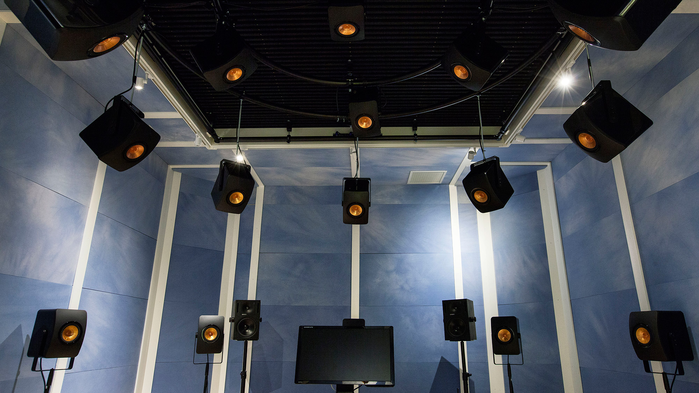

# Studio 3

Photo: Åsa Maria Mikkelsen

Speaker setups, project templates and resources for working with spatial audio in the speaker dome studio at NOTAM.

Studio equipment
================

The studio is equipped with 24 speakers in a hemisphere. The speakers
are evenly distributed at a distance of approximately 2.5 meters from
the listening position. The room is designed and built according to
strict acoustic demands. The modular walls are tuned with movable
absorbants and reflectors, resulting in an even frequency response.
Studio 3 is suitable for working with techniques such as ambisonics,
VBAP and Dolby Atmos. In contains the following equipment:

-   KEF LS-50 (24 channels)
-   Sonible D:24 amplifier
-   Ferrofish A/D converter
-   RME MADIface USB interface

For an in-depth explanation of the setup in Studie 3, read this paper.
It is possible to route signals to/from the recording room as well as
using microphones in Studio 3. Let the staff know in advance if this is
something you want to do. Please note: **You need to bring your own
computer**

Recommended software
====================

### DAW

Here at NOTAM the staff use [Reaper](http://reaper.fm/). We recommend
you do so as well, especially if you want to work with ambisonics or
multi channel audio in general. Reaper is cheap, flexible and very well
designed for experimental audio. As an added bonus, you are able to
automate and program any part of the program making it highly efficient
for any audio task imaginable. If you have any DAW related issues or
questions, feel free to ask but please note we are only able to support
you in these if you use Reaper.

### Plugins

We recommend you use the free and open source plugins of
[IEM](https://iem.at). The IEM plugin
suite contains everything you need for a high order ambisonic workflow.
The plugins are quite user friendly, relatively well documented and are
being continuosly developed and expanded by programmers at IEM. You can
download the plugins here: <https://plugins.iem.at/>. Read the
installation guide, plugin descriptions and tutorials:
<https://plugins.iem.at/docs/>.

### Programming

If you want to go deeper into the inner workings of ambisonics, we
recommend you use either [the Ambisonic Toolkit for SuperCollider](https://www.ambisonictoolkit.net/) or the visual programming language
[Max/MSP](https://cycling74.com/) in conjunction with [IRCAM\'s
Spat-package](https://forumnet.ircam.fr/product/spat-en/). 

#### Examples

This repository contains examples for different programming languages.

There is a folder with faust-files containing decoders for the studio which may be converted to almost any format, as well as SuperCollider and Max examples.

How to get started with ambisonics in Studio 3
==============================================

To get started, download and install Reaper and the IEM plugins on your
computer.

### Understanding Reaper

If this is your first time using Reaper you need to familiarize yourself
with the basic concepts of the program. Fortunately, every part of the
program has been very well documented over at Reaper\'s website which
contains [very useful video tutorials](http://reaper.fm/videos.php). The
minimum of Reaper concepts you need to understand are:

-   [Starting a new project](http://reaper.fm/videos.php#K4WhkBzK3PA)
-   [The Tracks](http://reaper.fm/videos.php#K4WhkBzK3PA)
-   [Basic Editing](http://reaper.fm/videos.php#zcX9odvs_lM)
-   [Plugins and FX](http://reaper.fm/videos.php#R0bL3cmERFY)
-   [Folders](http://reaper.fm/videos.php#29POS7h37Xk)
-   [Multi channel routing](https://www.youtube.com/watch?v=8CzL_7NPysk)
-   [Actions (optional)](http://reaper.fm/videos.php#tzg9fifza0s)

### Setting up an ambisonics project using IEM plugins

To set up a project in Reaper, read and follow [this tutorial by
IEM](https://plugins.iem.at/docs/tutorial_basicrouting/). 

Note that Studio 3 is a 3rd order ambisonics studio. 

After you are done setting up your project, you need to do one final thing to make it work
in studio 3: Load the speaker positions for the speaker array in studio
3 into the decoder on your Loudspeakers bus. This can be done by opening
the FX on that track, selecting the decoder and loading up this file.

For a more in-depth look at ambisonics mixing in Reaper, see [DX Arts\'
guide to mixing ambisonics](https://dxarts.washington.edu/wiki/ambisonic-mixing-reaper).
